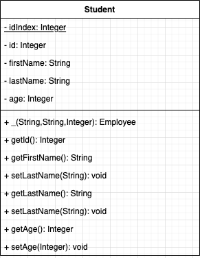
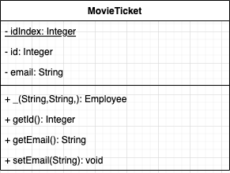

# Lab 18 B

* Part 1: Coding Challenge
* Part 2: In class
* Part 3: Homework

## Part 1 Coding Challenge

You have 30 mins to get as far in this challenge as possible. This is not about finishing, its about taking the correct steps to get to the end.

### Steps:

1. Comments, make sure you comment out every step you want to take, make a plan.
2. Start coding

### Problem

Given a word, check each letter in that word to see if its a vowel `[a,e,i,o,u]`. If there is a vowel return true, if there isn't a vowel return false.

#### Example 01

```
String input = "abc";
Boolean expected = true;
```

Because input contains the letter `a` , the return value should be `true`.

#### Example 02

```
String input = "xyz";
Boolean expected = false;
```

Because input contains no letters , the return value should be `false`.


When the instructor say's time is up here are the git commands you need to run

```
git add .
git commit -m "Ready for review"
git push 
```

## Part 2

### Example 01 

In the package `example.example01` open `Main` and play the tic tac toe game a few times.

* Comment the lines of code in `TicTacToe`, and see where `static` is being used
* Discuss in class about if it is needed.


### Example 02

In the package `example.example02` open `Company` and run the program a few times.

* Comment the lines of code in `Employee` and `Company`, and see where `static` is being used
* Open `EmployeeTest` run it a few times and comment those line of code out
* Discuss in class about if it is needed.

### Exercise 01



Above is the UML for a Student, notice `idIndex` is underlined, in UML this is how we lable a field as static.

* Complete the Student class based on the uml
	* Include a static integer idIndex field
	* This filed will count the total number of students instantiated
	* Initialized this field to 0
	* Increase this field everytime a student is instantiated
	* Complete all other fields and getters and setters
	* Complete all unit test for public fields. 

## Part 3 - Homework

Create a program that sells Movie Tickets :



* Each `MovieTicket` should have a unique ID assigned to it.
* Use `MovieTheater` to write all the functionality for selling tickets:
* `MovieTicket` should be fully unit tested

### Example Output

```
Welcome to CD Movie Theater Menu

1) Purchase a Ticket
2) Display all Ticket's sold
3) Exit

Please Select an Option:
1

You selected Purchase a Ticket.
Please enter the email address of ticket owner:
person1@example.com

A ticket with Id of 1 was sold to person1@example.com

Welcome to CD Movie Theater Menu

1) Purchase a Ticket
2) Display all Ticket's sold
3) Exit

Please Select an Option:
1

You selected Purchase a Ticket.
Please enter the email address of ticket owner:
person2@example.com

A ticket with Id of 1 was sold to person2@example.com

Welcome to CD Movie Theater Menu

1) Purchase a Ticket
2) Display all Ticket's sold
3) Exit

Please Select an Option:
2

**** Tickets Sold ****
Id (1) person1@example.com
Id (2) person2@example.com
****  End of List ****

Welcome to CD Movie Theater Menu

1) Purchase a Ticket
2) Display all Ticket's sold
3) Exit

Please Select an Option:
3

Goodbye
```


